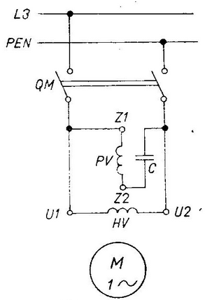

# Elektrické stroje
* netočivé - transformátory, elektromagnety, frézy
* točivé - motory, generátory
## Motory
### Asynchronní trojfázový motor
* používán jako 1F nebo 3F a také jako generátor
* v průmyslu je s klecovým rotorovým vynutím "nakrátko"
* jako generátor typicky použit ve větrných elektrárnách
* používá se tam, kde se nevyžaduje regulace otáček
* motor, u kterého jsou otáčky rotoru vždy nižší než otáčky magnetického pole statoru; proud v rotoru vzniká elektromagnetickou indukcí z točivého magnetického pole statoru
* skluz - rozdíl mezi otáčkami magnetického pole statoru a skutečnými otáčkami rotoru
* rotor
	* paket z izolovaných dinamoplechů s drážkami nebo póly na vnějším obvodu
	* kovové tyče vinutí zalisovány v drážkách, prochází jim zkratový proud krátce
	* dva kroužky spojující tyče nakrátko
	* drážky a tyče jsou zešikmeny z důvodu snížení hlučnosti vlivu harmonických proudů
* stator
	* jádro (paket) z izolovaných dynamoplechů s drážkami nebo póly na vnějším obvodu
	* vinutí z izolovaných měděných vodičů; zpravidla tří- nebo jedno-fázové; je vytvarováno a uloženo odděleně drážky izolovací v drážkách jádra
* název asynchronní znamená, že při zatížení neotáčí synchronní rychlostí (stejnou jako pole statoru), ale s určitým skluzem, který činní podle velikosti motoru 1 až 6 % a ve zvláštních případech i více
* staví se od jednotek watů až po 6 000 kW při asynchronním rozběhu; VN až do několika set kW; větší motory - vyšší napětí (3/6/10/35 kV)
* pólpáry - pólové dvojice (6 pólů = 3 pólpáry)
* rotor se nemůže točit podle synchronní rychlosti protože by se neobjevoval fázový posuv, musíme mít skluz
* momentová charakteristika

$n_s = \frac{60 * f}{p}$$kde $n_s$ je sync. rychlost; $p$ počet pólpárů; $f$ frekvence napájení (obvykle 50 Hz); jednotkou jsou otáčky za minutu ($ot/min$)
$$n = \frac{60 * f}{p}(1-s)$$kde $s$ je skluz v procentech; $n$ počet otáček
* štítky na motorech - druhy provozu (S1 až S10)
	* S1 - trvalý provoz
	* S2 - krátkodobý (v minutách)
* při spouštění je problémem proudový náraz
	* zmenšíme napětí zapojením do hvězdy a pak do trojúhelníka
	* motory s odporovou klecí - zvýšíme odpor změnou materiálu/délky/tloušťky drátu
	* motory s dvojitou klecí
		* horní klec (rozběhová) - velký činný odpor a malý jalový
		* dolní klec (pracovní) - malý činný odpor, okolo silný magnetický tok, velký indukční odpor
	* motory s vírovou klecí - při spouštění protéká větší proud horní částí a postupně klesá dolů
	* kroužkové motory s rotorovým spouštěčem - místo statoru 3 kroužky → při spouštění klesá odpor spouštěče do doby, kdy motor běží na normálních otáčkách a vinutí je spojeno nakrátko
	* spouštění pomocí frekvenčního měniče - nedochází k proudovému nárazu protože kmitočet stoupá od 0 k požadovanému
* komutátor nebo kroužky odvádějí/přivádějí proud do rotoru
* softstartér
	* plynulost je dosažena řízením napětí na svorkách motoru bez změny frekvence
	* neumí řídit otáčky motoru
* brzdění
	* odpojíme motor od sítě, mechanickým třením (moment se mění v teplo), protiproudem (libovolné fáze prohodíme, motor se začne otáčet na druhou stranu)
	* generátorické
		* motor se chová jako generátor
		* nejlepší co může být
		* rekuperace
	* dynamické (stejnosměr) - statorové vinutí se odpojí od sítě a připojíme na ss napětí; magnetické pole statoru se netočí a rotor se setrvačností dotočí sám (můžeme použít mechanické brzdění)
* ochrana
	* řízením automaticky
	* proti nadměrnému oteplení → odpojením motoru před dosažením max. provozní teploty
	* nadproudová a elektronická relé
### Asynchronní jednofázový motor
* pohon zařízení malých výkonů
* připojení vinutí statoru k střídavému napětí vzniká pouze střídavé pulsující magnetické pole (může se točit dodáním mechanické energie nebo vytvořením točivého magnetického pole statoru (nemusí být trvalé)); roztočíme rozběhovou pomocnou fází přes kondenzátor
* změna otáček/smyslu přehozením konců vinutí nebo hlavní fáze; otáčky jsou závislé na kmitočtu napájení a na počtu pólů
* točivé magnetické pole vzniká fázovým otočením o 90 °
* komutátor
	* při otočení o 180 ° zachovává/mění polaritu
	* přivádí/odvádí elektrickou energii z rotoru
	* mění frekvence

### Asynchronní lineární motor
* vyvolává lineární pohyb
* statorové vinutí rozřízlé a narovnané
* induktor - postupně vytváří magnetické pole odpovídající statoru trojfázového motoru
* kotva - tvořena masivním vodivým tělesem
* poháněno výřivými proudy
* rychlost závisí na kmitočtu budícího proudu; z důvodu velké vzduchové mezery a velkého odporu kotvy je rychlost menší než rychlost postupujícího pole
### Krokový motor
* součástí servopohonu
* nechceme setrvační pohyb
* nejmenší pohyb 1 krok
### Třífázový alternátor
* do cívek je přiveden stejnosměrný budící proud, který vytvoří z rotoru silný rotující elektromagnet
* otáčením rotoru vzniká v cívkách statoru třífázový proud; rotor je poháněn turbínou nebo jinak mechanicky
* skládá se z rotoru, statoru a budiče + chladící kontakty
* synchronní stroj je takový stroj, jehož kmitočet svorkového napětí je přímo úměrný otáčkám
* rozdělení
	* turboalternátor - pohon parní nebo plynový
	* hydroalternátor - vodní turbína
* rotor
	* z rotorového kola
	* 4 a více pólů; každý pól má svou budící cívku
