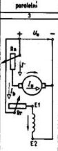

#silnoprouda_zarizeni
# Dynama
* nejstarším druhem elektrických strojů
* první princip dynama - Faraday; první dynamo - Edison
* stejnosměrný generátor
* dnes utlačován alternátory s usměrňovači
## Princip a konstrukce
* činnost založena na elmag. indukci
* budící proud vyvolává ve statoru mag. tok
* ve vinutí rotoru se při jeho otáčení v mag. poli indukuje střídavé napětí → komutátor jej mění na ss.
* ss. proud se kartáči komutátoru odvádí na svorkovnici

* stator
	* složen z trans. plechů
	* upevněny k němu hlavní a pomocné póly
	* na jádrech hl. pólů cívky budicího vinutí (napájené stejnosměrně)
	* polarity hlavních pólů se po obvodu statoru střídají
* rotor
	* složen z izolovaných trans. plechů
	* tvar drážkovaného válce
	* na hřídeli komutátor
	* vývody cívek rotoru připevněny k lamelám
## Reakce kotvy
* neutrální osa mag. toku
	* při chodu naprázdno v příčném směru
	* při zatížení posunuje ve smyslu otáčení
## Zapojení dynama
* dynamo s permanentním magnetem
* dynamo s cizím buzením
* derivační dynamo
* sériové dynamo
* kombinované (kompaundní) dynamo - kombinace derivačního a sériového dynama
# Stejnosměrné motory
* stejná konstrukce jako u dynama
* činnost se zakládá na silovém účinku mag. pole na vodič, jímž prochází proud
* rotor se otáčí ve smyslu proudu ve vodičích
* do vinutí se přivádí proud pomocí kartáčů komutátoru
* točivý moment rotoru je tvořen vzájemným působením mag. pole statoru a kotvy
* způsoby zapojení
	* s cizím buzením
		* vinutí statoru je připojeno k jinému zdroji než vinutí kotvy
		* záběrný moment je omezen odporem spouštěče
		* využití tam, kde je třeba plynulé řízení rychlosti
		
	* s paralelním buzením
		* spouštěč zapojen do série s vinutím kotvy
		* pro záběrný moment je budící vinutí zapojeno před spouštěním na plné napětí sítě
		* točivý moment úměrný proudu kotvy
		* při malém zatížení se nesmí přerušit budící obvod → nebezpečné zvýšení otáček
		
	  * se sériovým buzením
		  * vinutí hl. pólů zapojeno do série s vinutím kotvy
		
	* se smíšeným buzením
		* kombinace dobrých vlastností sériového a paralelního zapojení
		
	* motůrky
		* univerzální - sériové buzení; ss nebo stř. proud
		* s prem. mag. - vinutí s póly nahrazeno stálými magnety
		* smíšené - obdobná konstrukce; stejné vlastnosti
		* bezkontaktní - rotor z perm. mag.; 2 nebo 3 cívky přes tranzistory nahrazují komutátor
* řízení otáček - pomocí PWM regulátoru → mění se aktivní doba, kdy proud prochází motorem
* změna směru obrácením smyslu proudu v kotvě
* brzdění - do rezistorů, rekuperací nebo protiproudem