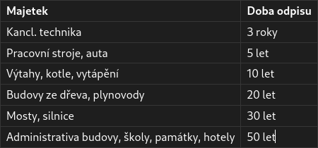

#ekonomika 
* podnik    
    * představuje společenství lidí kteří se zabezpečení hmotných statků a různých sližeb pro jiné lidi pro zisk
    * základní hospodářský článek hospodářství
    * různá forma vlastnictví
    * funkce plní na základě samostatného financování
    * prodává své výkony a dosahuje zisky
    * podle výkonu produkce
        * hmotné - cílem jsou statky
            * těžební podniky
            * zemědělské
            * peněžní a bankovní služby
            * zdravotnictví, kultura, zábava
	* živnosti do 10 zaměstnanců
		* malé podniky - do 50
		* střední podniky do 500 pracovníků
		* velké podniky nad 500 pracovníků
	* podle příslušnosti k odvětví
		* školství
		* stavebnictví
		* zemědělství, myslivost, lesní hospodářství
		* rybolov
		* zpracovatelský průmysl
		* zdravotnictví
	* podle vlastnictví
		* soukromé
		* státní
		* družstevní
	* podle hospodářského způsobu
		* hospodářské
		* rozpočtové
		* příspěvkové s částečným příspěvkem státu
	* neziskovky
		* životní prostředí (ŽP)
		* dostávají 12 miliard
	* funkce podniku
		* prodejní (odbytová)
		* hlavní činnost podniku
		* výroba nebo poskytování služeb
		* funkce personální
		* investiční funkce
		* správa a administrativa
		* bezpečnost
	* podnik a jeho okolí - město, obec, stát (stát bere prachy daněmi)
	* výroba
		* výsledek hlavní činnosti jsou výrobky nebo služby
		* fáze přípravy výroby
		    * technická - příprava technologie a konstrukce
		    * ekonomická - stanovení norem, spotřeby materiálu, kalkulace nákladů
		    * organizační - určuje, kde se výrobek bude vyrábět a jaké jsou potřebné nástroje
		* fáze výroby - peníze → výrobní zásoby → rozpracované výrobky → hotové výrobky (zboží) → expedice → prodej → peníze
		* typy výrob
		    * podle stupně mechanizace
		        * ruční výroba
		        * mechanizovaná výroba
		        * automatizovaná výroba
			* podle počtu vyráběných výrobků
				* kusová výroba
				* sériová výroba
				* hromadná výroba
		* výrobní kapacita - schopnost stroje, zařízení nebo celého výrobního útvaru (dílna provoz - spojení), kolik vytvoří v daném časovém úseku
	* řízení podniku - usměrňování činnosti podniku tak, aby byli zajištěny všechny činnosti podniku a dosaženo stanovených cílů; řízení provádějící vedoucí pracovníci (manažeři)
	* majetek
		* každý podnik musí mít pro svojí činnost potřebné výrobní zdroje
		* složení majetku se vyjadřuje v rozvaze    z Čeho financováno
		* suma - musí se v tomto případě rovnat aktiva a pasiva
		* majetková struktura
			* majetek podniku - majetkové hodnoty, patří podnikateli a slouží k podnikání
			* na dvě skupiny 
				* dlouhodobý
					* slouží déle než jeden rok
					* cena vyšší  než 80 000 Kč (hmotný) a 60 000 Kč (nehmotný)
					* odpisové třídy - **daňová optimalizace**
					* hmotné
						* nemovitý majetek
						* movitý majetek
							* pěstitelské celky trvalých prostorů
							* základní stádo a tažná zvířata
						* zvláštní skupinu drobný dlouhodobý hmotný majetek; cena nižší než 80 tis. Kč (do nákladů jednorázově)
					* nehmotný
						* majetek nemá hmotnou podobu; pořizovací cena vyšší než 60 000 Kč
						* patenty, licence, autorská práva, software, know-how
					* finanční
						* volné prostředky podnikatele určené pro další investice (pro výnos)
							* dlouhodobé cenné papíry, státní dluhopisy (ručí za ně stát), umělecká díla a sbírky, drahé kovy
							* má inventární kartu která obsahuje nebo el systém (kartotéka) název majetku, vstupní pořizovací cenu, datum pořízení
							* opotřebení dlouhodobého majetku je fyzické a morální
								* opotřebení je úbytek hodnoty majetku
								* fyzické - soustruh ztrácí přesnost
								* morální - způsobeno rozvodem
								* odpis 
									* úbytek v hodnotách vyjádřený v penězích
									* účetní odpisy - si volí podnik sám podle svých potřeb
									* daňové odpisy - jsou stanoveny zákonem; zákon přesně stanový do jaké třídy odpisové přesně zařadit
									* když roste cena roste, roste doba odpisu
									* $\text{rovnoměrná} = \frac{\text{vstupní cena} * \text{odpisová sazba}}{100}$
									* $\text{degresivní odpisování} = \frac{\text{vstupní cena}}{\text{koeficient}}$
									* jedou za rok se provádí odpis
									* **majetek kde cena roste tak se neodepisuje**
								* oprávky - souhrn odpisů za dobu používanou
				* oběžný