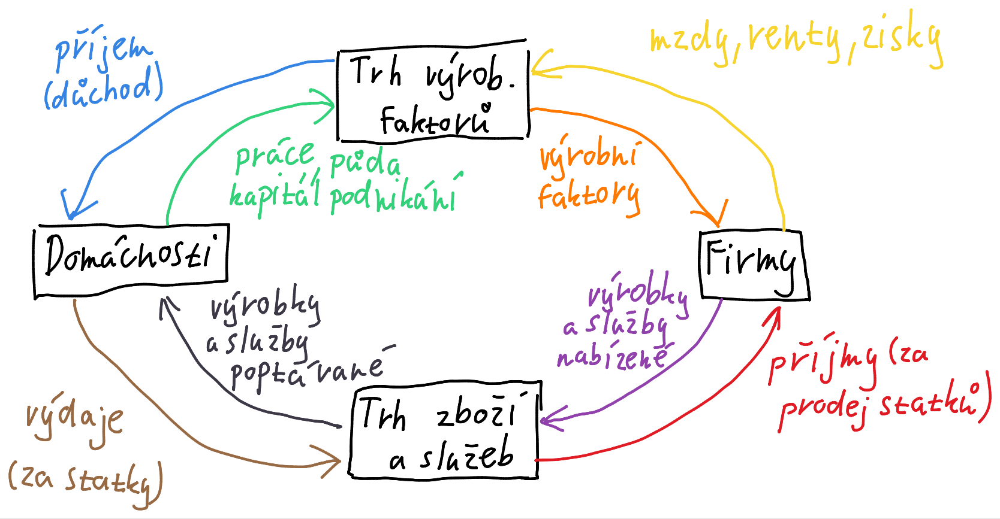

#ekonomika 
1) co je trh?
	  * místo, kde se setkávají kupující a prodávající
	  * střet nabídky a poptávky
	  * směna výrobků, služeb nebo peněz
2) ekonomický koloběh - schéma
	  * Schéma
3) základní subjekty trhu
	* domácnosti, podniky, stát
4) nabídka - graf
	* množství zboží, které jsou prodávající ochotni prodat za určitou cenu
	* roste cena roste i nabídka
	* Graf
5) 4 ekonomické systémy
	* zvykový - tradice a zkušenosti
	* příkazový - centrální plánování
	* tržní - vyrábí se, po čem je poptávka
	* smíšený - tržní systém doplněný o zásahy státu; dnešní doba
6) tržní rovnováha
	* konkurence - střed zájmů na poli trhu
	* Graf
7) poptávka - graf + popis
	* množství zboží, které jsou kupující ochotni koupit za určitou cenu
	* Graf
8) tržní selhání
	* monopol - jediný dodavatel
	* oligopol - několik málo výrobců chovající se jako monopol
	* monopolistická konkurence - několik výrobců chovající se jako monopol
	* monopson - monopol na straně poptávky
	* oligopsol - oligopol na straně poptávky
9) druhy konkurence
	* cenová (pouze cena)
	* necenová (kvalita)
	* nabídková
	* poptávková
10) monopolní úřad
	* antimonopolní úřad - schvaluje chůze podniku
	* úřad o ochraně hospodářské soutěže - chrání hospodářskou soutěž (transparentnost) mezi
	* energetický regulační úřad - stanoví max. cenu energií na kalendářní rok
	* regulace vodné stočné