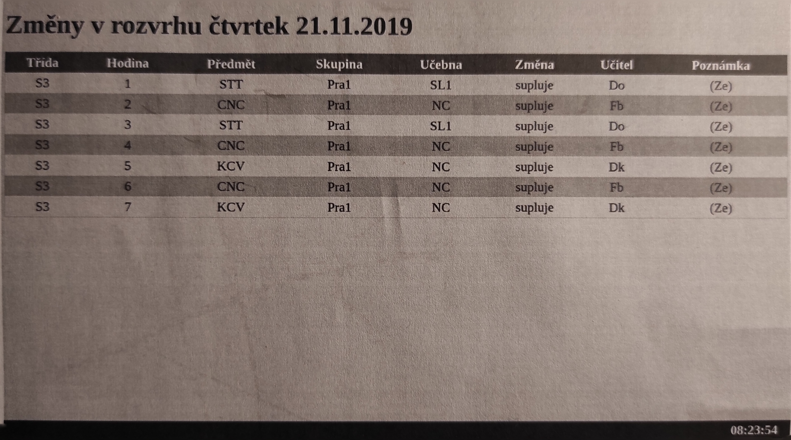

Vyrobte aplikaci, která bude generovat následující html výstup.

Veškeré potřebné soubory pro ověření funkčnosti (php soubory, sqldump databáze...) uložte do gitlabu. Práci průběžně ukládejte ať je vidět progres.

Veškerá data se budou načítat z databáze. Vyrobte si klidně jenom jednu tabulku s potřebnými sloupci.

Nápis změny v rozvrhu se bude zobrazovat s datem vždy na aktuální den. Tj. pokud aplikaci spustím v pondělí 21.10.2024 očekávám výstup: "Změny v rozvrhu pondělí 21.10.2024".

Barevný styl tabulky (střídání barev řádků) zajistěte pomocí css stylu. CSS styl bude v samostatném souboru a bude do html stránky vkládán za pomocí taku <link>

Konec stránky bude zvýrazněn černým pruhem. Hodiny dělat netřeba, ale jinak je můžete realizovat například za pomocí javascriptu.