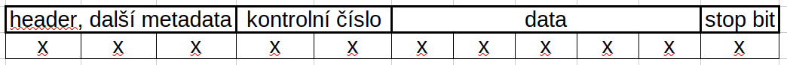

#technicke_vybaveni_pocitacu 
* synchronní sběrnice
	* přenos dat mezi zařízeními je synchronizován společným hodinovým signálem (generován masterem)
	* možnost využít jen jednu datovou linku
 * asynchronní sběrnice
	 * data jsou doprovázena speciálními signály označující začátek a konec přenosu
# Základní typy
* Universální Synchronní/Asynchronní Přijímač/Vysílač
	* umožňuje sériovou komunikaci a může být použita pro připojení k zařízením pomocí sériové sběrnice, jako je RS-232 nebo RS-485
* Serial Peripheral Interface *(SPI)*
	* sériové periferní rozhraní
	* pro komunikaci mezi řídícími mikroprocesory a ostatními integrovanými obvody (EEPROM, [[MO4 Signály#AD|A/D převodníky]], displeje...)
	* komunikace je realizována pomocí společné sběrnice
	* rozdělení zařízení
		* master
			* řídí komunikaci pomocí hodinového signálu
			* určuje, se kterým zařízením na sběrnici bude komunikovat pomocí SS *(Slave Select)*/CS
		* slave
			* vysílá podle hodinového signálu, pokud je aktivován pomocí SS/CS *(Chip Select)*
		
		
	* průběh komunikace
		* pro komunikaci master nastaví log. nulu na SS zařízení, se kterým chce komunikovat
		* master začne generovat hodinový signál na SCLK a v té chvíli vyšlou obě zařízení svoje data, přičemž MOSI *(Master Out, Slave In)* je vždy *Master výstup, Slave vstup* a MISO *(Master In, Slave Out)* je *Master Vstup, Slave výstup*
		* po vyslání dat komunikace dále pokračuje
			* master dále dodává hodinový signál, hodnota SS se nemění
			* master přestane vysílat hodinový signál a nastaví SS do log. jedničku
		* délka vyslaných dat je buď 8 bitů *(1 Byte)* a nebo 16 bitů
* I²C  *(Inter-Integrated Circuit)*
	* často využívána pro připojení senzorů nebo paměťových modulů
* Controller Area Network *(CAN)*
	* sériová datová sběrnice
	* nejčastěji pro vnitřní komunikační síť senzorů a funkčních jednotek v automobilu
	* elektrické parametry fyzického přenosu jsou specifikované normou `ISO 11898`; max teoretická rychlost přenosu na sběrnici je 1 Mb/s
	* síťový protokol detekuje přenosové chyby vzniklé od okolních elektromagnetických polí
	* data se odesílají v rámcích, každý rámec může obsahovat až 8 bajtů
	* rámec obsahuje kromě datového obsahu tzv. identifikátor; sběrnice CAN nepoužívá žádnou jinou "adresu"
	* identifikátor definuje obsah zprávy a zároveň i její prioritu
* Ethernet
	* pro průmyslové aplikace vyžadující síťovou konektivitu některé MCU obsahují integrovaný Ethernet kontrolér
* [[MO6 Přenos informace#Modulace|Pulse Width Modulation]]
* [[MO4 Signály#AD|A/D převodníky]]
* [[MO4 Signály#DA|D/A převodníky]]
* Watchdog Timer
	* periferie resetující systém při jeho zacyklení (k zacyklení může dojít chybou hardwaru nebo softwaru)
# Výhody sériové sběrnice
* vyžaduje pouze dva vodiče (pro přenos a příjem) → kabeláž je relativně jednoduchá a levnější
* stabilní a spolehlivá i na delších vzdálenostech (RS-232 umožňuje přenos dat na desítky metrů bez ztráty kvality signálu)
* v jednom fyzickém kanálu sběrnice může přenášet data pomocí multiplexování
* méně náchylná na rušení
# Konfigurace
1) výběr prokotolu (nejběžnějšími jsou RS-232, RS-485, UART, I2C, a SPI)
2) výběr rychlosti kompatibilní s ostatními zařízeními v síti
3) nastavit délku dat (kolik bitů tvoří datové slovo; typicky 8 bitů)
4) nastavit paritu na lichou paritu, sudou paritu nebo žádnou paritu
# Použití
## Software
* pro komunikaci mezi počítačem a periferními zařízeními (tiskárny, skenery, klávesnice a myši)
* pro přenos dat mezi počítači a dalšími zařízeními v síti v případech vyžadované spolehlivosti a nízké náročnosti na šířku pásma
* konfigurace a aktualizace firmware v embedded zařízeních, mikrokontrolérech a dalších hardwarových systémech
* logování dat *(zaznamenávání důležitých událostí, informací nebo dat v elektronické podobě)*
* komunikace s různými senzory a měřícími zařízeními
* vzdálená správa a řízení zařízení
## Hardware
* v průmyslových automatech pro komunikaci mezi řídicími systémy, senzory a akčními prvky
* pro monitorování a řízení zařízení, jako jsou motory, generátory nebo regulátory
* komunikace mezi různými částmi zařízení (např. mezi routerem a modemem)
# Podpůrné obvody
* poskytují dodatečné funkce, zlepšení výkonu nebo umožňují použití pro specifické aplikace
* Sběrnicové Transceivery
	* zajišťují převod úrovní signálu mezi logickým nulovým a jedničkovým stavem
	* odpovídají za řízení fyzického přenosu dat po sběrnici
* RS-232 Driver/Receiver
	* pro odesílání (driver) a přijímání (receiver) signálů RS-232
* RS-485/RS-422 Transceivery
	* komunikace na delší vzdálenosti a s více zařízeními na jedné sběrnici
* Izolátory Sběrnice
	* zabránění přenosu rušení a elektromagnetických interferencí mezi různými částmi systému
* Sběrnicové Přepínače
	* přepínání mezi různými sériovými zařízeními
* Sběrnicové Buffery
	* slouží k ukládání nebo zpracování dat
	* zvýšení rychlosti přenosu nebo dočasné ukládání dat pro vyrovnání
* Sériově-Paralelní Konvertory
	* umožňuje připojení sériově komunikujícího zařízení k paralelním rozhraním nebo naopak
* ESD ochrana
	* k ochraně zařízení před statickým elektrickým nabitím
* Sběrnicové Terminátory
	* zajištění správné impedance sběrnice a minimalizaci odrazů signálu
* Sběrnicové Routery a Rozbočovače
	* řízení datového toku na sběrnici a umožnění komunikace mezi více zařízeními
# Sběrnice
## SPI
* hlavní zařízením komunikuje s jedním nebo více periferními zařízeními pomocí čtyř nebo více signálů
* může současně přenášet data z masteru na slave a z slave zpět na master (full-duplex)
* společný hodinový signál mezi masterem a slavem
* SCLK *(Serial Clock)* - hodinový signál generovaný masterem řídící přenos dat
* MOSI *(Master Out Slave In)* - datový signál posílaný z mastera do slave zařízení
* MISO *(Master In Slave Out)* - datový signál posílaný z slave zařízení do mastera
* SS/CS *(Slave Select/Chip Select)* - signál oznamující, s kterým slave zařízením master komunikuje
* délka datového slova může být nastavena podle potřeby
* master řídí začátek, konec a rychlost přenosu dat
* přenosová rychlost aý 8 Mb/s
* pracovní napětí není pevně dáno; obvykle 0 V až 3.3 V nebo 5 V
## I²C
* využívá dvě sběrnicové linky 
	* SDA *(Serial Data Line)* - pro datovou komunikaci 
	* SCL *(Serial Clock Line)* - pro hodinový signál
* master vybírá s jakým zařízením komunikovat pomocí adresy
* možnost připojení více master/slave zařízení
* pracuje na asynchronním principu (hodiny nejsou generovány konstantní frekvencí); data jsou přenášena na hranu hodinového signálu
* podpora různé rychlosti přenosu dat
* pracovní napětí není pevně dáno; obvykle 0 V až 3.3 V nebo 5 V
* přenosová rychlost zmíněna [[MO7 Sběrnice#Standardy|zde]]
## RS-232
* asynchronní komunikace
* dvě linky pro komunikaci
	* TX *(Transmit)* - slouží k přenosu dat z vysílacího zařízení
	* RX *(Receive)* - slouží k příjmu dat přijímacího zařízení
* provozní napětí
	* log. nula - (+3; 15) V
	* log. jednička - (-3; -15) V
* rychlost přenosu v rozmezí od 300 bps *(bitů za sekundu)* do 115200 bps
* používána pro vzdálený přístup k počítačům a řízení zařízení na dálku
## USB
* využívá čtyři vodiče, ale primárně pracuje s dvěma hlavními linkami
	* D+ *(Data Plus)* - přenáší data
	* D- *(Data Minus)* - přenáší data
* možnost připojování a odpojování zařízení bez nutnosti vypínat počítač
* zařízení jsou rozlišena jako master (host) nebo slave (periferní zařízení)
* různé typy USB portů; každý má specifické použití a tvar konektoru
	* USB-A
	* USB-B
	* USB-C
	* mikro-USB
* různé rychlosti přenosu dat, včetně USB 2.0 (480 Mbps), USB 3.0 (5 Gbps), a USB 3.1/3.2 (až 10 Gbps)
* může poskytovat napájení periferním zařízením
* pracovní napětí se liší podle verze USB
	* USB 1.0, 2.0 a 3.0 obvykle 5 V
	* USB 3.1 a 3.2 až 20 V
## TWI
* kompatibilní s [[MO8 Jednoduché sériové sběrnice#I²C|I²C]]
* termín `TWI` byl používán kvůli ochranným známkám spojeným se značkou I²C
* využívá dvě linky pro komunikaci - datovou linku (SDA) a hodinovou linku (SCL)
* připojené zařízení má jedinečnou 7 nebo 10bitovou adresu
* podporuje multi-master komunikaci
* je asynchronní
* rychlosti přenosu dat v závislosti na implementaci
* pracovní napětí obvykle 3.3 V nebo 5 V
# Pakety
* slouží k organizaci a přenosu informací mezi zařízeními nebo komponentami v síti
* obsahuje různé pole a hlavičky, které umožňují identifikaci a interpretaci obsahu
* složení
	* hlavička *(header)* - obsahuje informace o struktuře a formátu datového rámce, pole adresy odesílatele a příjemce, kontrolní součet, délku dat a další metadata
	* data - samotná data, která jsou přenášena mezi zařízeními
	* kontrolní součet/číslo
	* stop bity - signalizují konec každého bajtu nebo bloku dat
	* další metadata
